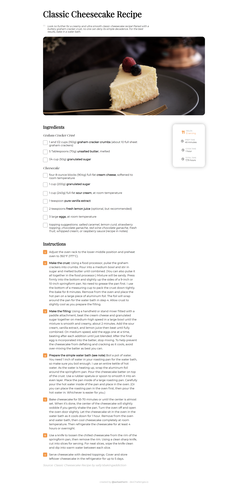

<h1 align="center">Recipe Page</h1>

   Solution for a challenge from  <a href="http://devchallenges.io" target="_blank">Devchallenges.io</a>.

  <h3>
    <a href="https://trusting-johnson-df7b33.netlify.app/">
      Demo
    </a>
     | 
    <a href="https://trusting-johnson-df7b33.netlify.app/">
      Solution
    </a>
     | 
    <a href="https://devchallenges.io/challenges/OEKdUZ6xs0h99C38XVht">
      Challenge
    </a>
  </h3>

<!-- TABLE OF CONTENTS -->

## Table of Contents

- [Overview](#overview)
  - [Built With](#built-with)
- [Features](#features)
- [Contact](#contact)
- [Acknowledgements](#acknowledgements)

<!-- OVERVIEW -->

## Overview

A **recipe page template** , with a _responsive design_ and checklist for each ingredient
You can see my demo [Here](https://trusting-johnson-df7b33.netlify.app/).
I enjoyed do this. I learned how to edit `checkbox` and other way to make order list without the tag `ol` and  `li`.
This practice will help me in my personal project. I will to do again but with [React.js](https://reactjs.org/). I think it'll be an excellent practice and it'll give me a great skills.

### Built With

<!-- This section should list any major frameworks that you built your project using. Here are a few examples.-->

- [HTML]()
- [CSS]()
- [FontAweson](https://fontawesome.com/)

## Features

<!-- List the features of your application or follow the template. Don't share the figma file here :) -->

This application/site was created as a submission to a [DevChallenges](https://devchallenges.io/challenges) challenge. The [challenge](https://devchallenges.io/challenges/TtUjDt19eIHxNQ4n5jps) was to build an application to complete the following user stories:

- [x] User story: This is a completed user stories
- [ ] User story: This is a incompleted user stories
- [ ] User story: This is a incompleted 2nd user stories

## Acknowledgements

<!-- This section should list any articles or add-ons/plugins that helps you to complete the project. This is optional but it will help you in the future. For exmpale -->

- [¿Cómo mejorar la velocidad de carga de tu web optimizando las imágenes?](https://marketerosdehoy.com/diseno-web/mejorar-velocidad-carga-web-optimizando-imagenes/)
- [CSS Reference](https://www.w3schools.com/cssref/default.asp)
- [Marked - a markdown parser](https://github.com/chjj/marked)

## Contact

- GitHub [@sarkastherin](https://github.com/Sarkastherin)
- Twitter [@sarkastherin](https://twitter.com/SarKastherin)
